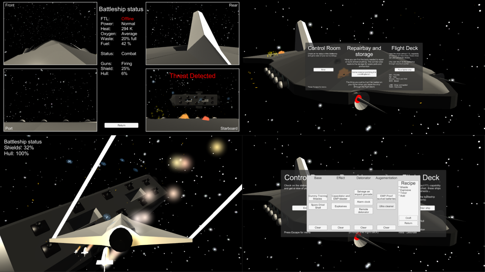

# Battleship Handyman - Ludum Dare 32

Spaceflight and MacGyver simulator.
You have to think and act quickly or your battleship will be overwhelmed.

My entry to the 32:nd Ludum Dare game jam (theme: An Unconventional Weapon), following the compo rules (alone, from scratch, 48 hours).

[Download the game here](https://github.com/Aggrathon/LudumDare32/releases) or [check out the Ludum Dare entry](http://ludumdare.com/compo/ludum-dare-32/?action=preview&uid=37874) (dead link)!

## Tips

- Open the menu (Escape) to change sensitivity.
- It is possible to use a controller, even if the layout isn't shown.
- The fightership is almost Newtonian (meaning that you continue in the direction you were heading even if you turn your ship another way). There is however dampening on turning, making it much easier to steer.

## Software used

- Unity 5
- Blender
- Gimp
- Spacescape
- Visual studio
- (No audio due to running out of time)

## Screenshots

